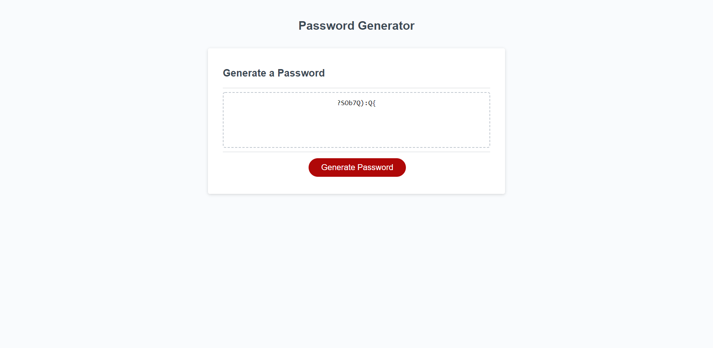

# Password-Generator

In this project I used VSCode to add code to the existing script.js file. I created variables inside a new function and used if statements, iteration and array methods. I then pushed my changes to this created github repo and deployed the project on github pages.  

Link to deployed page: https://nickwojt.github.io/password-generator/

